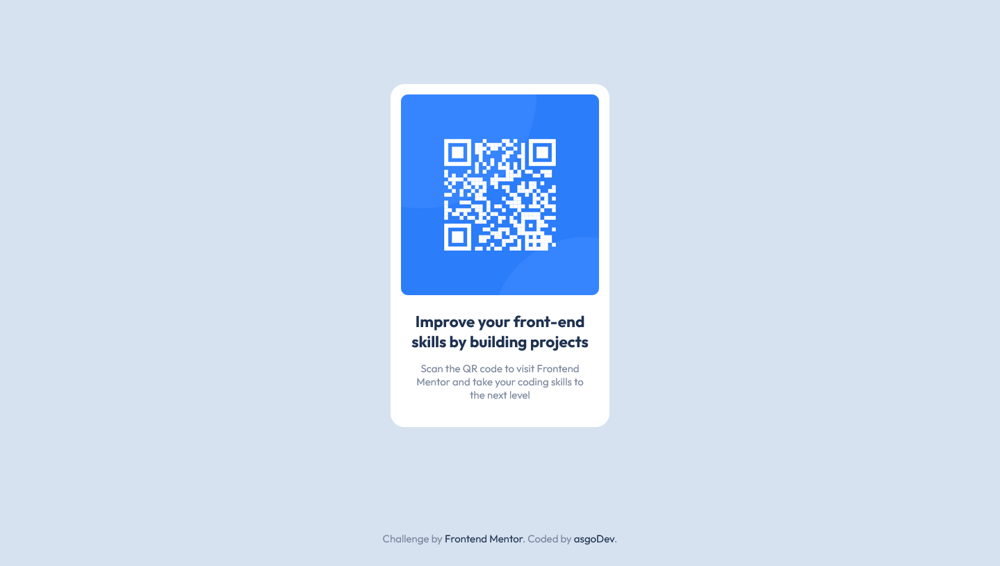

# Frontend Mentor - QR code component solution

This is a solution to the [QR code component challenge on Frontend Mentor](https://www.frontendmentor.io/challenges/qr-code-component-iux_sIO_H). Frontend Mentor challenges help you improve your coding skills by building realistic projects. 

## Table of contents

- [Overview](#overview)
  - [Screenshot](#screenshot)
  - [Links](#links)
- [My process](#my-process)
  - [Built with](#built-with)
  - [Continued development](#continued-development)
  - [Useful resources](#useful-resources)
- [Author](#author)
- [Acknowledgments](#acknowledgments)

## Overview

### Screenshot

### Links

- Solution URL: [Add solution URL here](https://your-solution-url.com)
- Live Site URL: https://asgodev.github.io/qr-code-component/

## My process

### Built with

- Semantic HTML5 markup
- CSS custom properties
- Flexbox, for the card
- CSS Grid, for the layout

### Continued development

In this project I added a mediaquery to make it responsive. But I still need to delve into that topic. I would like card grown horizontal and vertlicaly when viewport is in landscape orientation.

### Useful resources

- (https://developers.google.com/fonts/docs/css2?hl=es-419) - This article helped me for use google fonts easily.

## Author

- Frontend Mentor - [@asgoDev](https://www.frontendmentor.io/profile/AquilesGonzalezDev)

## Acknowledgments

midudev

